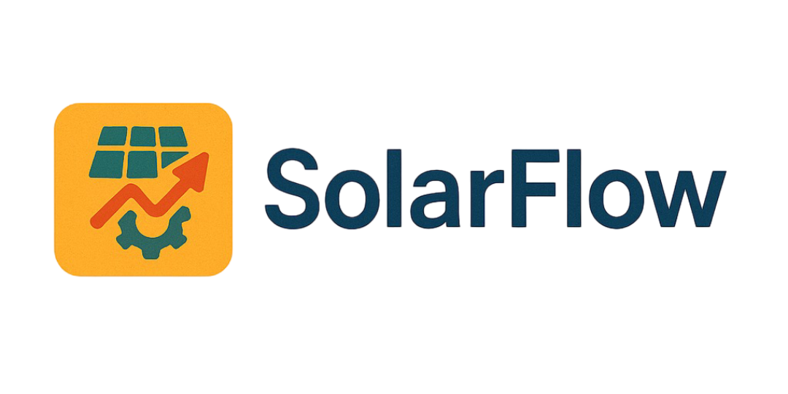
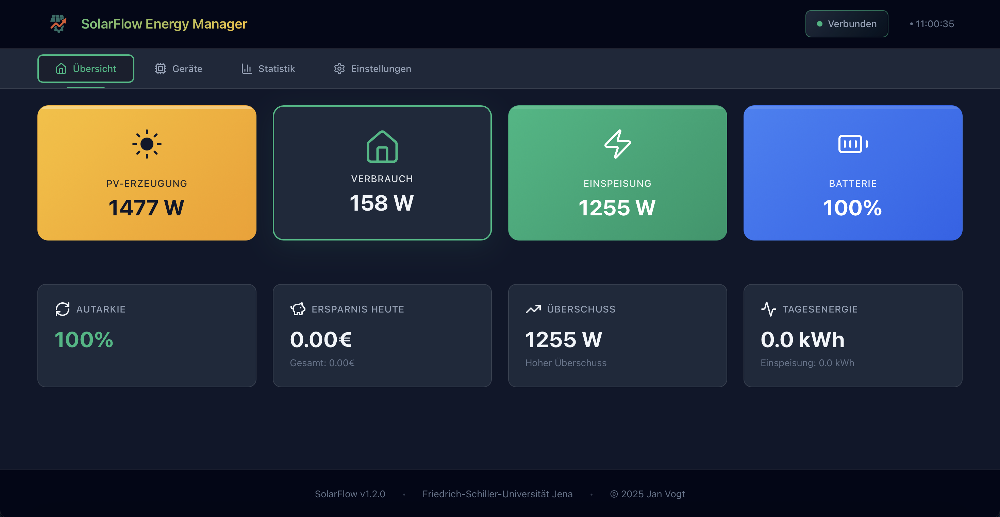
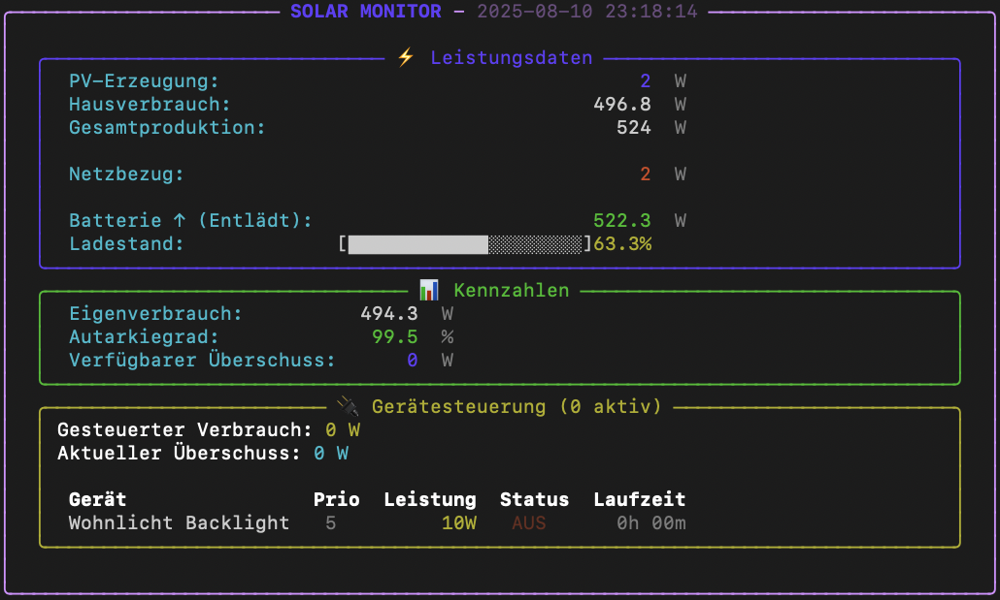

# SolarFlow Smart Energy Management

<p align="center">
  
</p>

<p align="center">
  <strong>☀️ Intelligentes Energie-Management für Ihre Solaranlage</strong><br>
  <sub>Maximieren Sie Ihren Eigenverbrauch • Sparen Sie Stromkosten • Schonen Sie die Umwelt</sub>
</p>

<p align="center">
  <a href="https://github.com/JanVogt06/SolarFlow-SmartEnergyManagement/releases/latest">
    
  </a>
  <a href="https://janvogt06.github.io/SolarFlow-SmartEnergyManagement/">
    
  </a>
  <a href="https://github.com/JanVogt06/SolarFlow-SmartEnergyManagement/blob/main/LICENSE">
    
  </a>
</p>

---

## 🎯 Was ist SolarFlow?

SolarFlow ist ein benutzerfreundliches Energie-Management-System für **Fronius Solaranlagen**. Es hilft Ihnen, Ihren selbst erzeugten Solarstrom optimal zu nutzen und dadurch Stromkosten zu sparen.

### Das macht SolarFlow für Sie:
- 📊 **Zeigt Ihre Solarproduktion in Echtzeit** im Browser
- 🔌 **Schaltet Geräte automatisch ein** wenn genug Solarstrom da ist
- 💰 **Berechnet Ihre Ersparnis** und zeigt Tagesstatistiken
- 📱 **Funktioniert auf jedem Gerät** mit Webbrowser (PC, Tablet, Smartphone)
- 🏠 **Steuert smarte Geräte** wie Philips Hue Steckdosen

## 🚀 Schnellstart (5 Minuten)

### 1️⃣ Programm herunterladen

Laden Sie die passende Version für Ihr System herunter:

| System | Download | Hinweis |
|--------|----------|---------|
| **Windows** | [⬇️ SolarFlow-windows-x64.exe](https://github.com/JanVogt06/SolarFlow-SmartEnergyManagement/releases/latest/download/SolarFlow-windows-x64.exe) | Doppelklick zum Starten |
| **macOS** | [⬇️ SolarFlow-macos-x64](https://github.com/JanVogt06/SolarFlow-SmartEnergyManagement/releases/latest/download/SolarFlow-macos-x64) | Terminal: `chmod +x` dann starten |
| **Linux** | [⬇️ SolarFlow-linux-x64](https://github.com/JanVogt06/SolarFlow-SmartEnergyManagement/releases/latest/download/SolarFlow-linux-x64) | Terminal: `chmod +x` dann starten |

### 2️⃣ Programm starten

**Windows:**
- Doppelklick auf `SolarFlow-windows-x64.exe`
- Falls Windows warnt: "Weitere Informationen" → "Trotzdem ausführen"

**macOS/Linux:**
```bash
# Datei ausführbar machen (nur beim ersten Mal)
chmod +x SolarFlow-*

# Programm starten
./SolarFlow-*
```

### 3️⃣ Browser öffnet automatisch

Das Web-Dashboard öffnet sich automatisch unter: **http://localhost:8000**

Falls nicht, öffnen Sie einen Browser und geben Sie die Adresse manuell ein.

### 4️⃣ Fronius IP-Adresse eingeben

Starten Sie das SolarFlow Backend mit der IP-Adresse Ihrer Fronius Anlage:

```bash python main.py --ip```

Oder verwenden Sie die Executable:

```bash SolarFlow-windows-x64.exe --ip```

Beispiele:

```bash
python main.py --ip 192.168.1.100
```
```bash
SolarFlow-windows-x64.exe --ip 192.168.178.99
```

## 📸 So sieht's aus

### Web-Dashboard

*Modernes Web-Dashboard mit Live-Daten Ihrer Solaranlage*

### Terminal-Ansicht (optional)

*Zusätzliche Terminal-Ansicht für Technik-Interessierte*

## ✨ Hauptfunktionen

### 📊 Live-Monitoring
- **Echtzeitdaten** von Ihrem Fronius Wechselrichter
- **Übersichtliche Grafiken** für:
  - Aktuelle Solarproduktion
  - Hausverbrauch
  - Einspeisung ins Netz
  - Batteriestand (falls vorhanden)
- **Tagesstatistiken** mit Kostenberechnung

### 🔌 Intelligente Gerätesteuerung
- **Automatisches Ein-/Ausschalten** von Geräten bei Solarüberschuss
- **Prioritätssystem**: Wichtige Geräte werden zuerst eingeschaltet
- **Zeitsteuerung**: Geräte nur zu bestimmten Zeiten (z.B. Poolpumpe nur tagsüber)
- **Philips Hue Integration**: Steuert echte Smart-Home-Geräte

### 💰 Kostenanalyse
- **Tägliche Ersparnis** in Euro
- **Eigenverbrauchsquote** und Autarkiegrad
- **Vergleich**: Was hätte der Strom ohne Solar gekostet?
- **Einspeisevergütung** wird berücksichtigt

## ⚙️ Erweiterte Einstellungen

### Geräte konfigurieren

SolarFlow kann Ihre Haushaltsgeräte intelligent steuern. Erstellen Sie eine `devices.json` Datei:

```json
[
  {
    "name": "Waschmaschine",
    "power_consumption": 2000,
    "priority": 3,
    "switch_on_threshold": 2200,
    "switch_off_threshold": 1800,
    "allowed_time_ranges": [["08:00", "20:00"]]
  },
  {
    "name": "Poolpumpe", 
    "power_consumption": 750,
    "priority": 6,
    "switch_on_threshold": 1000,
    "switch_off_threshold": 500,
    "allowed_time_ranges": [["10:00", "18:00"]]
  }
]
```

### Kommandozeilen-Optionen

Für erfahrene Nutzer gibt es zusätzliche Startoptionen:

```bash
# Mit direkter IP-Angabe starten
SolarFlow --ip 192.168.178.90

# Ohne Web-Interface (nur Terminal)
SolarFlow --no-api

# Mit angepasstem Update-Intervall (Sekunden)
SolarFlow --interval 10
```

## 🔗 Nützliche Links

- 🌐 **Web-Dashboard**: http://localhost:8000 (nach dem Start)
- 📚 **API-Dokumentation**: http://localhost:8000/docs
- 🏠 **Projekt-Website**: [janvogt06.github.io/SolarFlow-SmartEnergyManagement](https://janvogt06.github.io/SolarFlow-SmartEnergyManagement/)
- 🐛 **Probleme melden**: [GitHub Issues](https://github.com/JanVogt06/SolarFlow-SmartEnergyManagement/issues)

## 💡 Häufige Fragen

<details>
<summary><b>Wie finde ich die IP-Adresse meines Fronius Wechselrichters?</b></summary>

1. **Im Router nachschauen**: 
   - Router-Oberfläche öffnen (meist `192.168.1.1` oder `192.168.178.1`)
   - Nach "Verbundene Geräte" oder "DHCP-Clients" suchen
   - Nach "Fronius" oder "Solar" suchen

2. **Am Wechselrichter-Display**:
   - Menü → Einstellungen → Netzwerk → IP-Adresse

3. **Mit der Fronius Solar.web App**:
   - In der App ist die lokale IP sichtbar
</details>

<details>
<summary><b>Funktioniert SolarFlow mit meinem Wechselrichter?</b></summary>

SolarFlow funktioniert mit allen **Fronius Wechselrichtern**, die die Solar API unterstützen:
- Fronius Symo
- Fronius Primo  
- Fronius GEN24
- Fronius Tauro
- Und weitere...

Die Solar API ist bei den meisten Fronius Wechselrichtern ab Baujahr 2013 verfügbar.
</details>

<details>
<summary><b>Kann ich SolarFlow von unterwegs nutzen?</b></summary>

Standardmäßig läuft SolarFlow nur in Ihrem Heimnetzwerk. Für Zugriff von außen:
- VPN zu Ihrem Heimnetzwerk einrichten
- Oder Port-Weiterleitung im Router (Sicherheitsrisiko beachten!)
</details>

<details>
<summary><b>Was kostet SolarFlow?</b></summary>

**Nichts!** SolarFlow ist komplett kostenlos und Open Source. Sie können es beliebig nutzen und sogar den Quellcode anpassen.
</details>

## 🛠️ Für Entwickler

<details>
<summary><b>Von Quellcode ausführen</b></summary>

```bash
# Repository klonen
git clone https://github.com/JanVogt06/SolarFlow-SmartEnergyManagement.git
cd SolarFlow-SmartEnergyManagement

# Abhängigkeiten installieren
pip install -r requirements.txt

# Starten
python SolarFlow.py --ip <FRONIUS_IP>
```
</details>

<details>
<summary><b>Eigene Builds erstellen</b></summary>

```bash
# PyInstaller installieren
pip install pyinstaller

# Executable erstellen
pyinstaller SolarFlow.spec --clean
```
</details>

## 🤝 Unterstützung & Beitrag

- **Probleme?** [Issue erstellen](https://github.com/JanVogt06/SolarFlow-SmartEnergyManagement/issues/new)
- **Fragen?** [Discussions](https://github.com/JanVogt06/SolarFlow-SmartEnergyManagement/discussions)
- **Verbesserungen?** Pull Requests sind willkommen!

## 📄 Lizenz

Dieses Projekt steht unter der MIT-Lizenz - siehe [LICENSE](LICENSE) für Details.

---

<p align="center">
  <b>⭐ Gefällt Ihnen SolarFlow?</b><br>
  Geben Sie dem Projekt einen Stern auf GitHub!<br><br>
  <sub>Made with ❤️ für nachhaltige Energienutzung</sub>
</p>